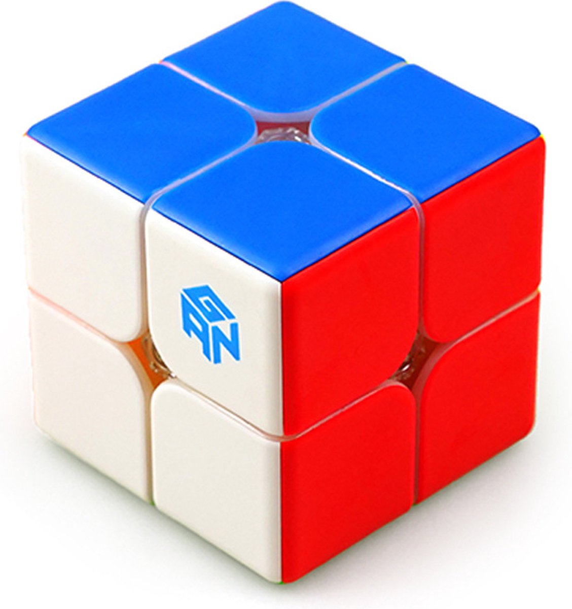
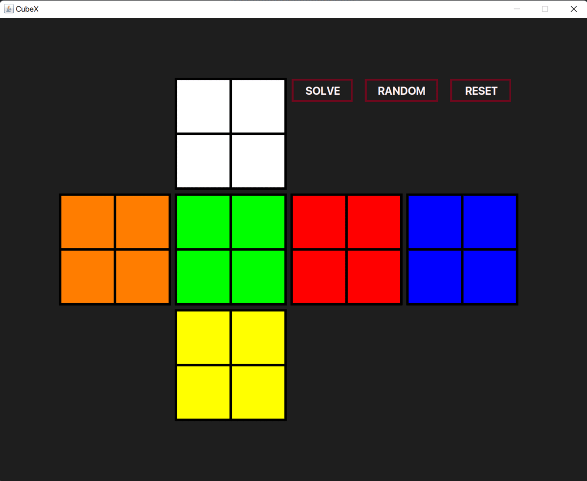

# 🎲 CubeX: Master the 2x2 Cube with Ease

<div align="center">
  
  <p><em>The Ultimate 2x2x2 Rubik's Cube Solver</em></p>
</div>

---

## 🚀 About CubeX

**CubeX** is a powerful and intuitive Java application that solves the 2x2x2 Rubik's Cube (Pocket Cube) in **14 moves or fewer** using a bidirectional Breadth-First Search (BFS) algorithm. With a user-friendly 2D cube net interface, users can input their cube's state, generate random scrambles, and follow clear, step-by-step solutions to solve their physical cube.

### 🎯 Perfect For:
- 🔰 **Beginners** learning cube solving
- 🧩 **Puzzle enthusiasts** seeking optimal solutions
- 🎓 **Educators** teaching algorithms and mathematics
- 💻 **Developers** exploring graph algorithms

---

## 🎬 See CubeX in Action

### **CubeX: A Pocket Cube Solver**
<div align="center">
  
  <p><em>Watch CubeX solve a scrambled 2x2x2 cube in real-time!</em></p>
</div>

---

## ✨ Key Features

| Feature | Description | Icon |
|---------|-------------|------|
| **Interactive Cube Net** | Click cubelets to input configuration with color cycling | 🎨 |
| **Optimal Solver** | Uses bidirectional BFS for solutions ≤14 moves | ⚡ |
| **Random Scrambles** | Generate practice scrambles with move sequences | 🎲 |
| **Reset Function** | Restore cube to solved state instantly | 🔄 |
| **Solution Display** | Shows move sequence and computation time | 📊 |
| **Cross-Platform** | Built with Java Swing/AWT for all OS | 🌐 |

---

## 🔧 How CubeX Works

### 🎥 **Live Demo**
The animated demo above shows the complete workflow:
1. **Input Phase**  - Setting up the scrambled cube configuration
2. **Solve Phase**  - Computing the optimal solution using bidirectional BFS
3. **Result Phase** - Displaying the solution sequence and execution time

### 📥 **Step 1: Input Your Cube**
- 🖱️ Click each of the 24 cubelets in the 2D net interface
- 🎨 Cycle through six colors: **White**, **Red**, **Green**, **Orange**, **Yellow**, **Blue**
- ✅ Interface validates input for solvable cube states

### 🎲 **Step 2: Randomize or Solve**
- 🎯 Click **RANDOM** to generate scrambles (up to 17 moves)
- 🧠 Click **SOLVE** to compute optimal solution using bidirectional BFS
- ⏱️ Get solutions in **14 moves or fewer**

### 🎯 **Step 3: View and Apply Solution**
- 📋 Solution sequence appears in "SOLUTION" label
- ⏰ Computation time shown in "TIME ELAPSED" label
- 🔄 Use **RESET** to restore solved state

### 🤖 **Algorithmic Efficiency**
- 🔍 Bidirectional BFS searches from both current and solved states
- 📊 Navigates **3,674,160** possible configurations efficiently
- 💾 Uses HashMaps and ArrayDeques for optimization

---

## 🏆 Why CubeX Stands Out

### 🆚 **Compared to Other Solvers**

| Advantage | CubeX | Traditional Methods |
|-----------|-------|-------------------|
| **Move Count** | ≤14 moves ⚡ | Up to 200 moves 🐌 |
| **User Interface** | Intuitive 2D net 🎨 | Complex notation 📝 |
| **Learning Curve** | Beginner-friendly 🔰 | Steep learning curve 📈 |
| **Performance** | Lightweight & fast 🚀 | Resource intensive 💻 |
| **Educational Value** | Algorithm teaching 🎓 | Limited learning 📚 |

---

## 📁 Directory Structure

```
CubeX/
├── 📂 src/
│   ├── 🖼️ RenderableInterface.java      # Interface for rendering graphics
│   ├── ⚙️ RubiksCubeConfiguration.java  # Manages cube state and move permutations
│   ├── 🎨 RubiksCubeNetStructure.java   # Renders and handles 2D cube net interaction
│   ├── 🖥️ RubiksCubeUserInterface.java  # Main UI with buttons and labels
│   └── 🚀 Main.java                     # Driver class with bidirectional BFS solver
├── 📂 images/
│   └── 🎬 cubex.gif                     # Animated demo (featured above!)
├── 📂 docs/
│   └── 📄 Report on Minor Project - CubeX.pdf # Comprehensive project report
├── 📖 README.md                         # Project documentation
└── 📜 LICENSE                           # MIT License file
```

---

## 🛠️ Installation

### 📥 **Clone the Repository**
```bash
git clone https://github.com/Nikhil-1920/CubeX.git
cd CubeX
```

### ☕ **Set Up Java Environment**
```bash
# Verify Java installation
java -version

# If not installed, download from Oracle Java
```

### 🔨 **Compile the Source Code**
```bash
javac -d bin src/*.java
```

### 🚀 **Run the Application**
```bash
java -cp bin rubik.Main
```

---

## 📖 Usage Guide

### 🎮 **Getting Started**

> 💡 **Tip:** Refer to the animated demo above to see each step in action!

1. **🚀 Launch CubeX**
   - Run the application to open the graphical interface
   - View the 2D cube net with 24 cubelets representing six faces

2. **🎨 Input Cube Configuration**
   - Click each cubelet to cycle through colors
   - Match your physical cube's configuration
   - Example: Red front face → click until cubelet turns red

3. **🎲 Generate Random Scramble**
   - Click **RANDOM** button for practice scrambles
   - View scramble sequence in "SCRAMBLE" label

4. **🧠 Solve the Cube**
   - Click **SOLVE** button to compute solution
   - View solution and time in respective labels
   - Apply moves to your physical cube

5. **🔄 Reset the Cube**
   - Click **RESET** to restore solved state

### 📊 **Example Output**
```
🎲 Scramble: F U' R2 F' U
🎯 Solution: U R' U' R F2
⏱️ Time Elapsed: 0.47 seconds
```

---

## 🎯 Move Notation

| Move | Description | Icon |
|------|-------------|------|
| **F** | Front face clockwise | 🔄 |
| **F'** | Front face counterclockwise | 🔄 |
| **F2** | Front face 180 degrees | 🔄 |
| **U** | Upper face clockwise | ⬆️ |
| **U'** | Upper face counterclockwise | ⬆️ |
| **U2** | Upper face 180 degrees | ⬆️ |
| **R** | Right face clockwise | ➡️ |
| **R'** | Right face counterclockwise | ➡️ |
| **R2** | Right face 180 degrees | ➡️ |

---

## 🧠 Algorithm Deep Dive

### 🔍 **Bidirectional BFS Algorithm**

**CubeX** uses a sophisticated bidirectional Breadth-First Search algorithm:

- 🎯 **How It Works:** Searches from both current and solved states simultaneously
- 📊 **State Space:** Navigates 3,674,160 possible configurations
- 💾 **Implementation:** Uses HashMaps and ArrayDeques for efficiency
- ⚡ **Result:** Optimal solutions in ≤14 moves (God's Number for 2x2x2)

### 🔰 **For Beginners**
Think of CubeX as a smart GPS that finds the shortest route by checking both your starting point and destination, meeting in the middle for the fastest path! 🗺️

---

## 🚀 Future Enhancements

### 🎯 **Roadmap**

| Quarter | Enhancement | Status |
|---------|-------------|--------|
| **Q1 2026** | 🎮 3D Visualization & 📷 Camera Input | 🔄 Planning |
| **Q2 2026** | 📱 Mobile Apps (Android/iOS) | 🔄 Planning |
| **Q3 2026** | 🎲 3x3x3 Cube Support & 🎓 Tutorials | 🔄 Planning |
| **Q4 2026** | 🎮 Gamification & 🏫 Educational Content | 🔄 Planning |

### 💡 **Planned Features**
- 🎮 **3D Visualization** with jMonkeyEngine/JOGL
- 📷 **Camera Input** using OpenCV
- 📱 **Mobile Support** for Android/iOS
- 🎓 **Tutorial Mode** for learning manual techniques
- 🏆 **Gamification** with achievements and leaderboards

---

## 🤝 Contributing

Welcomes contributions to make CubeX even better! 

### 📋 **How to Contribute**
1. 🍴 Fork the repository
2. 🌿 Create a feature branch (`git checkout -b feature/your-feature`)
3. 💾 Commit your changes (`git commit -m "Add your feature"`)
4. 🚀 Push to the branch (`git push origin feature/your-feature`)
5. 📝 Open a Pull Request on GitHub

### 📝 **Guidelines**
- ✅ Include tests using JUnit
- 🎨 Follow existing code style
- 📚 Update documentation as needed

---

## 🙏 Acknowledgments

- 👨‍🏫 **Dr. Prem Nath** - Project supervisor and guidance
- 👨‍💻 **Nikhil Singh**  - Developer and B.Tech student at HNBGU
- 📚 **Resources:**
  - 🔢 The Mathematics of the Rubik's Cube
  - 🎓 You Can Do The Cube
  - 🎨 Rubik's Color Resolver
  - 🧱 Programmable Brick: Rubik's Cube Tracker

---

